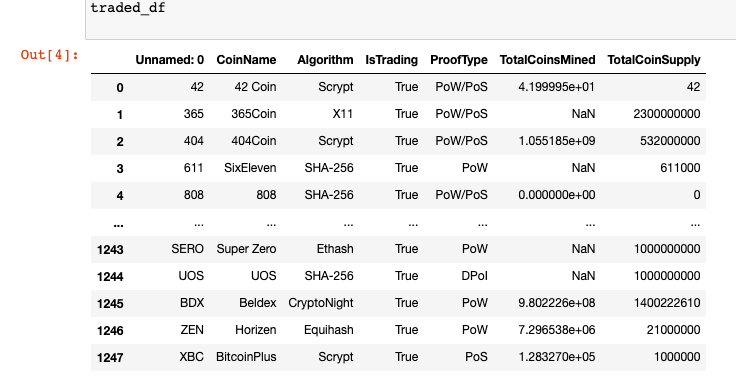
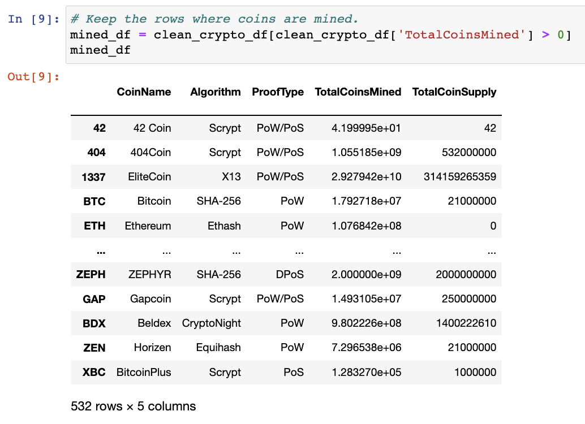
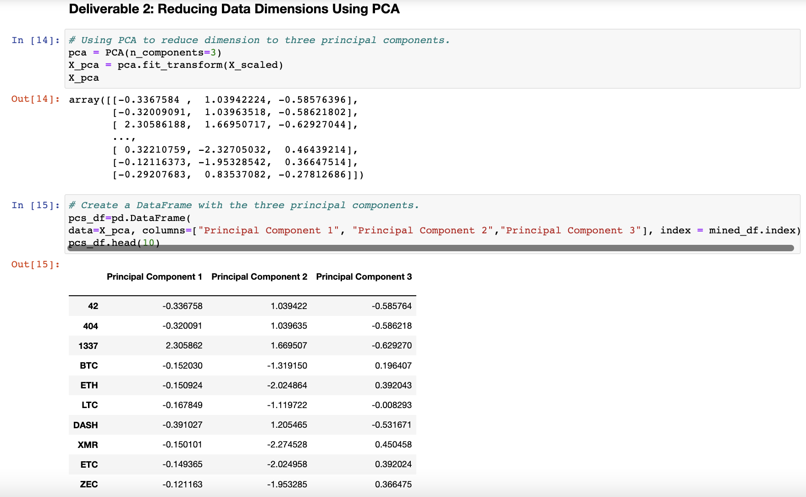
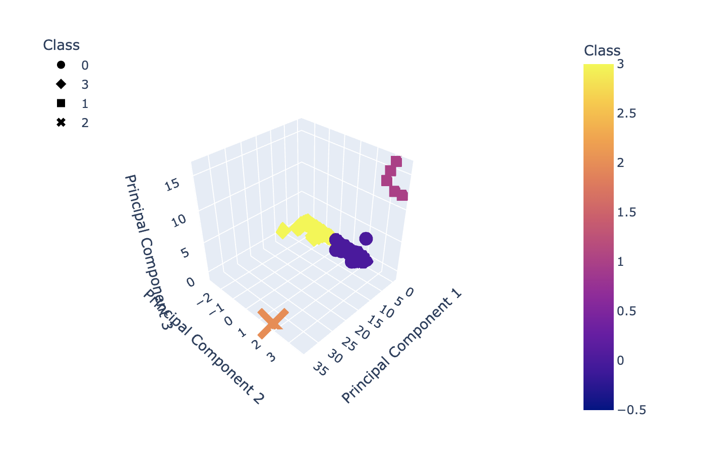
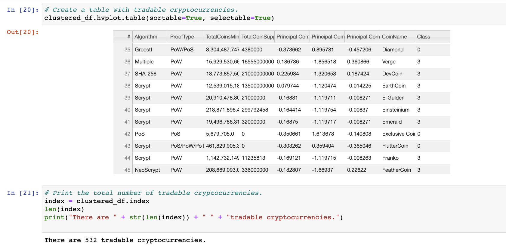

# Cryptocurrencies

## Purpose and Overview

For this project, we are using unsupervised machine learning to determine which cryptocurrencies are worth investing in. Because we do not know the outputs of this data, in order to create a system of classification, we processed the data with unsupervised machine learning. This meant clustering them using the K-Means algorithm and then using PCA to develop the model.

## Results

### Imported DataFrame before cleaning

### DataFrame after cleaning

### Reducing data dimensions using PCA

### 3D Scatter plot with clusters

### Number of tradable cyrptocurrencies

### Crypto scatterplot

