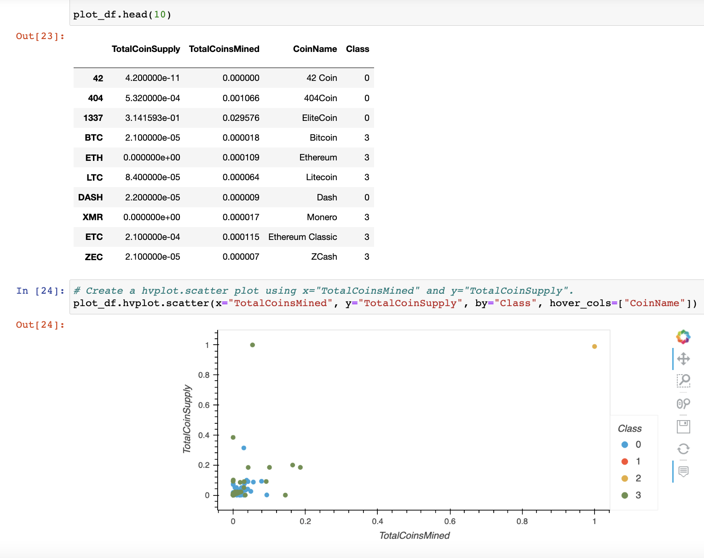

# Cryptocurrencies

## Purpose and Overview

For our project, we employed unsupervised machine learning techniques to assess the viability of various cryptocurrencies for investment purposes. Since we didn't have predefined labels or outputs for the data, we utilized unsupervised learning methods to analyze and classify the data. Our approach involved clustering the cryptocurrencies using the K-Means algorithm and applying Principal Component Analysis (PCA) to build our model.

By using the K-Means algorithm, we grouped similar cryptocurrencies together based on their features and characteristics. This clustering process allowed us to identify patterns and similarities among the cryptocurrencies in our dataset.

Next, we applied PCA to reduce the dimensionality of the data. PCA helps in capturing the most relevant information from the dataset by transforming the original features into a new set of uncorrelated variables called principal components. These principal components represent the essential information that can be used to make predictions or in our case, assess the investment potential of cryptocurrencies.

Overall, our project utilized unsupervised machine learning techniques such as clustering with K-Means and dimensionality reduction with PCA to create a classification system for assessing the investment worthiness of cryptocurrencies.

## Results

### Imported DataFrame before cleaning

### DataFrame after cleaning

### Reducing data dimensions using PCA

### 3D Scatter plot with clusters

### Number of tradable cyrptocurrencies

### Crypto scatterplot

